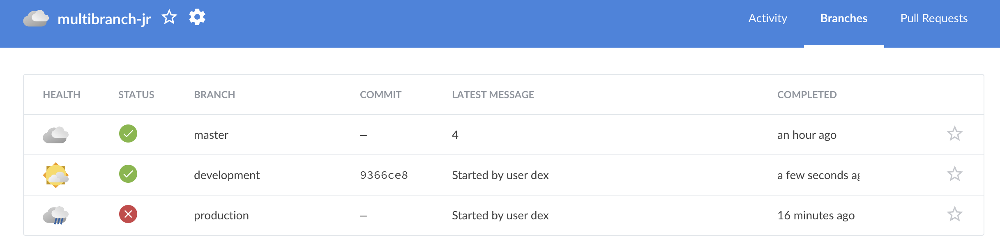
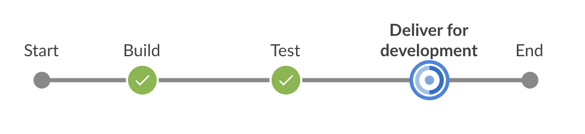
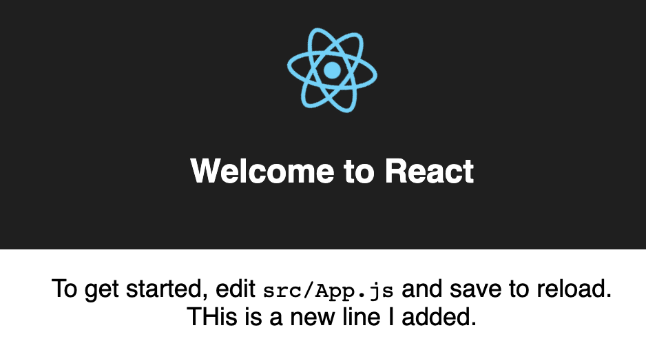

# building-a-multibranch-pipeline-project

This repository is for 
[Build a multibranch Pipeline project](https://jenkins.io/doc/tutorials/build-a-multibranch-pipeline-project/)
tutorial in the [Jenkins User Documentation](https://jenkins.io/doc/).

This tutorial uses the same application that the [Build a Node.js and React app
with
npm](https://jenkins.io/doc/tutorials/build-a-node-js-and-react-app-with-npm/)
tutorial. Therefore, you'll build and test the same
application but this time, the delivery will be different depending on the Git
branch that Jenkins pipeline builds from. That is, the built branches determines which delivery stage of the pipeline.

The `jenkins` directory contains an example of the `Jenkinsfile` (i.e. Pipeline)
you'll be creating yourself during the tutorial and the `scripts` subdirectory
contains shell scripts with commands that are executed when Jenkins processes
either the "Deliver for development" or "Deploy for production" stages of your
Pipeline (depending on the branch that Jenkins builds from).

## Modify the docker working directory
To fix `npm ERR! Please try running this command again as root/Administrator.` we can add `HOME= '.'` under `environment` to run under current directory rather than build as `root`

The finished code looks like this:
```
'pipeline {
    agent {
        docker {
            image 'node:6-alpine'
            args '-p 3000:3000 -p 5000:5000'
        }
    }
    environment {
        HOME = '.'
        CI = 'true'
    }
```


## Following [this](https://tempora-mutantur.github.io/jenkins.io/github_pages_test/doc/tutorials/build-a-multibranch-pipeline-project/#pull-your-updated-jenkinsfile-into-the-other-repository-branches) guide to run docker locally

Click on proceed to and visit http://localhost:3000 to view the page




## Running Jenkins on EC2 / Azure VM

Modify the security group of the Jenkins instance to allow inbound traffic on Port 3000 from your IP address (DO NOT allow traffic from 0.0.0.0/0 for best security practices)
